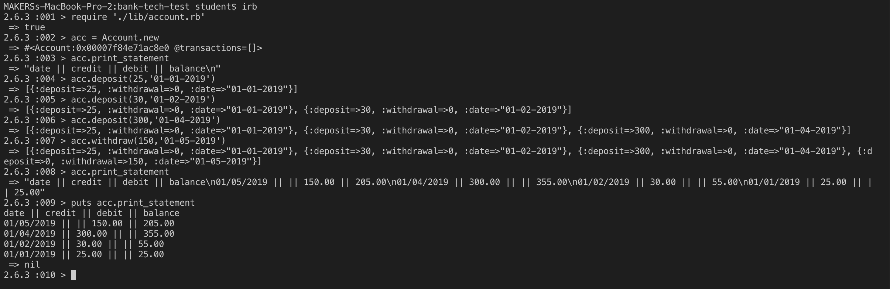

# Bank Tech Test

Tech Test at Makers Acedemy

## How to Install

* Clone this repository
* Install dependencies

```console
bundle install
```

## How to Run

This application runs in the irb. A screenshot is included below. Note that to print the statement on multiple lines you should prefix the method call with puts.



## How to Test

```console
$ rspec
```

## Code Quality

```
$ rubocop
```

## Approach

I've organised my work using the process stages below.

* Read - Read the requirements and ask questions.

* Plan - Sketch out user interactions, and objects behaviour.
* Test - Write tests to describe the behaviour required.
* Implement - Write code to pass the tests.

* Refactor - SOLID, SRP etc.
* Commit - Regular commits on green, with clear imperative commit messages.

## Requirements

* You should be able to interact with your code via a REPL like IRB or the JavaScript console. (You don't need to implement a command line interface that takes input from STDIN.)
* Deposits, withdrawal.
* Account statement (date, amount, balance) printing.
* Data can be kept in memory (it doesn't need to be stored to a database or anything).  
